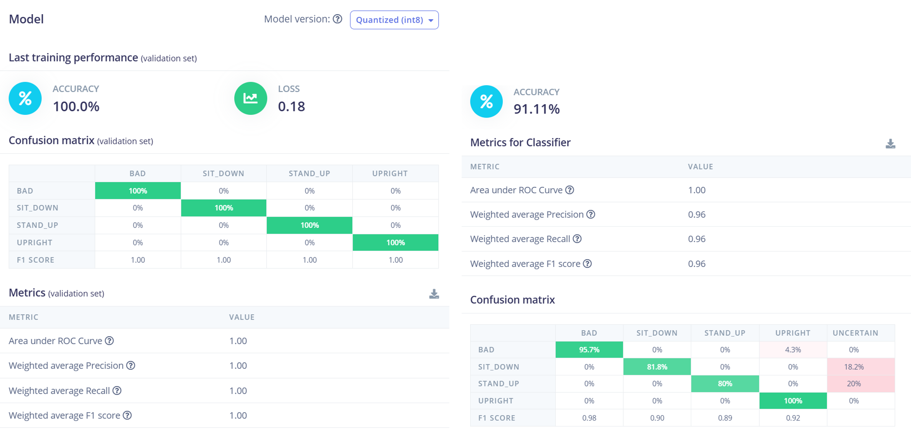

# Intelligent Sitting Posture Detector

An intelligent device that monitors and improves users’ sitting posture, combining posture detection and Pomodoro timer functions. Developed with the Arduino Nano BLE 33, Edge Impulse, NeoPixel LEDs, and vibration motors.

## 🔗 Project Links

- **GitHub Repo**: [casa0018-Intelligent-Sitting-Posture-Detector](https://github.com/SiruiLuo/casa0018-Intelligent-Sitting-Posture-Detector)
- **Edge Impulse Project**: [studio.edgeimpulse.com/studio/649253](https://studio.edgeimpulse.com/studio/649253)

## 📝 Introduction

This device helps users maintain good sitting posture in learning and working environments, while also acting as a Pomodoro timer. It uses built-in accelerometer and gyroscope sensors on the Arduino Nano BLE 33 for data collection and posture classification via a neural network model deployed at the edge.

   
  <b>Fig.1</b> Intelligent Sitting Posture Detector

**Key Features:**
- Real-time posture monitoring and feedback (LEDs + vibration)
- Pomodoro timer with posture awareness
- No need for expensive force/pressure sensors integrated in the chair
- Edge ML model deployment using Edge Impulse

## 📚 Research Questions

1. How to use embedded devices and IMU sensors (acceleration/gyroscope) for posture detection and deploy ML models?
2. How to extend device features after achieving accurate posture detection (e.g., Pomodoro timer)?

## ⚡️ Application Overview

- **Data Collection:** Uses Arduino Nano BLE 33's built-in accelerometer and gyroscope.
- **Model Training:** Custom dataset with 4 posture labels (Bad, Upright, Stand_Up, Sit_Down), trained with Edge Impulse.
- **Deployment:** Model exported as TensorFlow Lite, runs on Arduino Nano BLE 33.
- **Feedback:** NeoPixel LEDs (green = good, red = bad, yellow = standing), vibration motor alert.

   
  <b>Fig.2</b> Project structure

## 🗂️ Dataset

- 6-axis IMU data (acceleration + gyroscope, 3 axes each)
- 4 posture classes, 260 samples, 2000ms per sample (~10 min total)
- Data collected from multiple users for feature diversity
- Magnetic induction sensor disabled to ensure IMU purity

   
  <b>Fig.4</b> Data feature visualization

## 🤖 Model & Experiments

The selected neural network architecture:

- Input: 78 features (from IMU)
- Two Dense layers (32 and 16 neurons), Dropout(0.3), Output(4 classes)
- Compared different architectures:
  - 78×32×16×4 (best: high accuracy and generalization, F1=0.96)
  - 78×20×10×4 (slightly lower train accuracy, but strong F1=0.98)
  - 78×32×16×8×4 (overly deep, led to poor performance)
- Optimized for edge deployment: lightweight, efficient, robust

   
  <b>Fig.5</b> Selected model structure

## 📈 Results

   
  <b>Fig.6</b> 78×32×16×4 model performance

- **Best Model:** 91.1% test precision, F1=0.96
- **Generalization:** No significant overfitting, high validation accuracy
- **Finding:** Shallow networks with more neurons per layer are better for low-dimensional IMU data

## 🚀 Future Work

- Try different optimizers (Adam, SGD, etc.)
- Explore classifier structures for more complex datasets
- Investigate deeper networks with richer sensor data

## 📚 References

1. Matuska, S., Paralic, M. and Hudec, R. (2020) [A smart system for sitting posture detection based on force sensors and mobile application](https://doi.org/10.1155/2020/6625797), Mobile Information Systems.
2. [Intelligent Posture Training: Machine-Learning-Powered Human Sitting Posture Recognition Based on a Pressure-Sensing IoT Cushion](https://www.mdpi.com/1424-8220/22/14/5337) (MDPI Sensors).
3. Anwary, A.R. et al. (2021) ‘Smart-cover: A real time sitting Posture monitoring system’, Sensors and Actuators A: Physical, 317, p. 112451. [Link](https://doi.org/10.1016/j.sna.2020.112451)
4. [Edge Impulse Arduino Library Documentation](https://docs.edgeimpulse.com/docs/run-inference/arduino-library)
