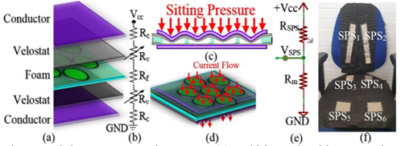
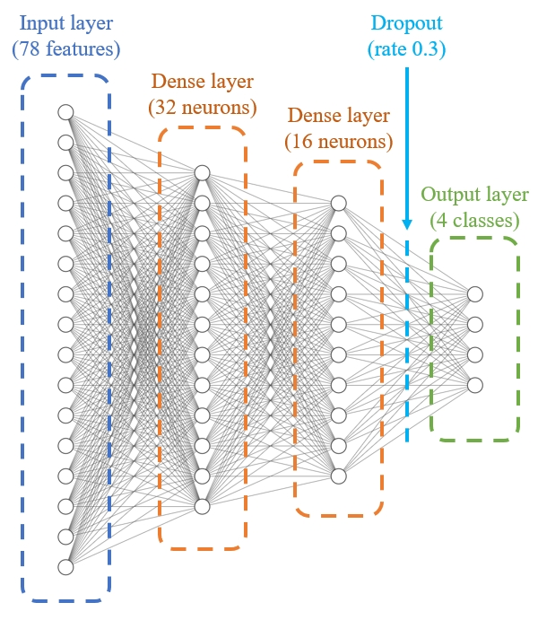
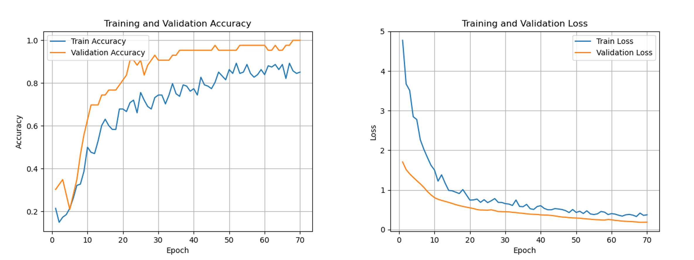

# Intelligent Sitting Posture Detector

Sirui Luo, link to github repo with project work in / link to Edge Impulse projects
Github repo: https://github.com/SiruiLuo/casa0018-Intelligent-Sitting-Posture-Detector
Edge Impulse Project: https://studio.edgeimpulse.com/studio/649253

## Introduction
Intelligent Sitting Posture Detector is a device that reminds users to maintain good sitting posture in learning and working environments, and also serves as a Pomodoro timer to help manage study or work time.

   
  <b>Fig.1</b> A kind of intelligent sitting posture detector structure

The motivation for creating this device came from the growing use of posture detection technology in deep learning. Deploying sitting posture detection on edge devices has shown to be both lightweight and efficient, and various sensors can be used to achieve this goal. For example, pressure sensors embedded in chairs allow for Intelligent Posture Training (n.d.), while force feedback sensors and modifications to seat cushions can also enable posture detection (Matuska, Paralic and Hudec, 2020). Additionally, simple threshold-based detection can be achieved by monitoring whether pressure sensor readings surpass set values (Anwary et al., 2021). However, these methods commonly require sensors to be integrated directly into the chair, usually involving four to five sensors for proper linkage, which significantly increases the project’s cost. By deploying neural network models that use data from accelerometers and gyroscopes, posture detection can be made more practical. Embedding these sensors in wearable clothing allows for continuous, cost-effective, and user-friendly monitoring.

## Research Question
1. How to use embedded devices (such as Arduino Nano Ble 33) to interact with acceleration sensors and gyroscopes to generate models that can be used to detect sitting postures and deploy them on the device.
2. How to expand the functionality of the product based on the successful detection of sitting posture, such as adding a Pomodoro timer function to manage study time.

## Application Overview

   
  <b>Fig.2</b> Project circuit diagram and schematic

This device integrates the Edge Impulse model training platform, an edge device, and actuators. In the initial phase, the Arduino Nano BLE 33 was selected as the MCU, using its built-in accelerometer and gyroscope to collect data through the Edge Impulse CLI. A custom dataset containing two sensor types and six dimensions was created, labeled as bad sitting posture, good sitting posture, standing up, and sitting down. After training, validation, and testing, the neural network model was deployed onto the device in Tensorflow Lite quantized format.

For actuation, the system uses an eight-bead NeoPixel light strip and vibration motors. The core logic works as follows: When the user maintains a proper sitting posture, the NeoPixel LEDs light up green sequentially. If the user remains in good posture for 25 minutes, all LEDs illuminate and begin flashing, indicating a completed Pomodoro session. If a bad sitting posture is detected, the LEDs turn red and the vibration motor activates, prompting the user to adjust. Once the user returns to a good posture, the lights revert to green and timing continues. If the user stands up during a session, the LEDs switch to yellow and return to green upon sitting down, providing continuous and intuitive feedback on posture and activity.

## Data

   
  <b>Fig.3</b> Illustration of four types of data collection

The project uses a dataset that was self-made and manually cropped. The main process involves activating the acceleration sensor and gyroscope on the Arduino Nano BLE 33 board and connecting it to Edge Impulse for sampling(Arduino Library, no date). The dataset mainly consists of three-axis acceleration data and three-axis gyroscope data. It has six dimensions and is divided into four labels: Bad, Upright, Stand_Up, Sit_Down. The total number of samples is 260, each data point is 2000ms, and the duration is nearly 10 minutes. Since the magnetic induction sensor built into the board is automatically activated when sampling azimuth data using Edge Impulse, when I created Impulse later, I disabled the magnetic induction data on the spectrum selected in the processing block to ensure the purity of the data set. At the same time, students from the laboratory were invited to sample the data together, enhancing the diversity of the features.

   
  <b>Fig.4</b> Generated data feature diagram

## Model

   
  <b>Fig.5</b> Selected model structure

This study constructed a classifier using the fully connected convolutional neural network architecture. Training was conducted through the obtained three-axis acceleration data and three-axis gyroscope data, generating a total of 78 features in the Input Layer. Two Dense layers are followed, with 32 and 16 neurons respectively, serving as fully connected layers. These two layers complete spectral analysis and feature abstraction. Finally, before the features were flattened into four classes, a Dropout layer was set, with a Dropout Rate of 0.3 to avoid overfitting.

During the research process, multiple models were tested, and control variable experiments were conducted respectively on the depth of the connection Layer and the number of neurons in the Dense Layer. However, the experimental results show that due to the simple characteristics of the acceleration data and gyroscope data, they are not suitable for neural networks with excessive depth. Moreover, when the number of network layers is fixed, the number of neurons in each Layer should be appropriately increased, which is helpful for feature extraction and can retain more features before entering the final Output Layer.

## Experiments

In this study, after determining the experimental model, the dataset independently collected by the project was used for training and comparative experiments. Among them, the main body for training is the model mentioned in the previous section and two variants of this model. In terms of parameters, a training frequency of 70 epochs was set for all models, and forced interrupts were set to prevent overfitting. The learning rates were all maintained at 0.0005 to control the variables.

   
  <b>Fig.6</b> 78×32×16×4 model performance

For the 78×32×16×4 model determined by the project, the accuracy rate of the model reached 100% during training, and it has a strong generalization ability. During the test, the precision rate reached 91.11%, and the performance was very ideal. And it reached 0.96 in both Recall and F1 score, indicating that the cases of false positives and missed detectives were rare.

   
  <b>Fig.7</b> Train & validation accuracy and loss curves

A more detailed look shows that there is almost no overfitting phenomenon in the model. In the early stage of training, the accuracy of both training and validation gradually increases, and the loss decreases. The effect is normal. In the later stage of training, the training accuracy (accuracy) was close to 0.9, the validation set accuracy (val_accuracy) was also above 0.95, and even reached 1.0 in the last few epochs. Both the loss and val_loss are reduced very low, and the validation loss curve and the training loss curve are very close. This indicates that the model performs well on both the training set and the validation set.

   

   
  <b>Fig.8</b> 78×20×10×4 model structure & performance

Secondly, the structure of the 78×20×10×4 model is shown in the above figure. The accuracy rate of the model reached 95.56% during training, which was slightly worse than that of the first model. However, during testing, the precision rate reached 95.56%, and the performance was actually better than that of the first one. This grounding indicates that reducing the number of neurons in the fully connected layer will increase the difficulty of regression calculation during model training, but it can enhance the universality of the model. The model achieved 0.98 in both Recall and F1 score, indicating that the cases of false positives and missed detectives were rare.

   

   
  <b>Fig.9</b> 78×32×16×8×4 model structure & performance

Finally, the structure of the 78×32×16×8×4 model is shown in the above figure. The accuracy rate of the model during training only reached 60.5%, which was significantly worse than that of the previous two models. During testing, the precision rate only reached 13.33%, and the performance was very poor. The error rate of some labels in the confusion matrix even reaches 100%. This indicates that data such as acceleration and gyroscope are not suitable for deep neural networks. Networks that are too deep will significantly reduce the data features. The model only achieved around 0.60 and 0.53 respectively in terms of Recall and F1 score, indicating that there were many cases of false positives and missed detectives, and the model performance was average.

## Results and Observations
This project has basically accomplished the pre-set goals and conducted control variable experiments on three different fully connected neural networks. The following two major conclusions are mainly produced in the research aspect:

1. Under the same number of fully connected layers, appropriately increasing the number of neurons in the Dense Layer can help the model better regression to the local minimum during training and improve the generalization ability of the model.

2. For data types with simple features and low dimensions, deep network structures may not be suitable. The reason is that the deepening of the network structure and the number of layers may overly abstract some features of the data, thereby causing the data to lose its features and resulting in confusion among the data.

For future work, I will attempt to conduct more comparative experiments. The main research point lies in what the best classifier structure is and how to use different optimizers such as (Adam, SGD, etc.) when training with multiple data types and data of different dimensions simultaneously like in this study. Secondly, for network models with greater depth, what data are most suitable for using such models for classifier training should be delved deeper.

## Bibliography
*If you added any references then add them in here using this format:*

1. Matuska, S., Paralic, M. and Hudec, R. (2020) ‘A smart system for sitting posture detection based on force sensors and mobile application’, Mobile Information Systems, 2020, pp. 1–13. doi:10.1155/2020/6625797. 

2. Intelligent Posture Training: Machine-Learning-Powered Human Sitting Posture Recognition Based on a Pressure-Sensing IoT Cushion (no date). Available at: https://www.mdpi.com/1424-8220/22/14/5337 (Accessed: 28 April 2025).

3. Anwary, A.R. et al. (2021) ‘Smart-cover: A real time sitting Posture monitoring system’, Sensors and Actuators A: Physical, 317, p. 112451. doi:10.1016/j.sna.2020.112451. 

4. Arduino Library (no date) Edge Impulse Documentation. Available at: https://docs.edgeimpulse.com/docs/run-inference/arduino-library (Accessed: 28 April 2025). 

## Declaration of Authorship

I, Sirui Luo, confirm that the work presented in this assessment is my own. Where information has been derived from other sources, I confirm that this has been indicated in the work.

*Sirui Luo*

ASSESSMENT DATE

Word count: 1562 words apart from reference
